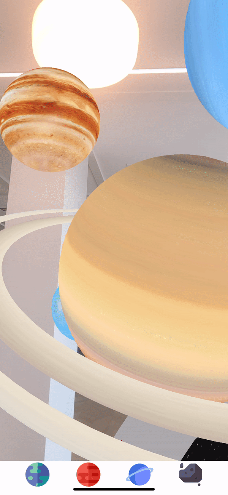

# Welcome to StellAR!  🚀

**Discover Space in Augmented  Reality**

Get hands-on with planets, stars, asteroids and moons with StellAR. **Explore** the Gas Giants, Asteroid Belt and Terrestrial planets - and jump into **AR Portals** to learn impressive space facts! Whether you’re looking to pop-up and traverse space in your living room, or you’re eager to **learn** about some of our universe's most captivating astronomical objects - StellAR has an Augmented Reality experience guaranteed to make both your **mind & jaw DROP**!

# Tech Stack

StellAR has been built using React Native, ViroReact, Redux, Vectary, Adobe After Effects and Facebook's Spark AR Studio. 

 1.  **React Native**  
 The core of StellAR is built using JavaScript in React Native. This framework was chosen to allow for possible deployment on both Android and iOS.
  
 2. **ViroReact**  
 ViroReact integrates with React Native to facilitate full AR functionality. This includes plane recognition, object placement, interactivity with 3D objects and the facilitation of AR Portals. 
 
 3. **Redux**  
 Redux was added to the project to best manage application state and navigation. 
 
 4. **Vectary**  
 3D scenes and objects were built using Vectary's 3D Design and Modelling platform. Each was exported as an FBX file that was converted to Viro's own VRX format using the ViroFBX script.
 
 5. **Adobe After Effects**  
 AR Portal scenes were built as 360-degree videos in Adobe After Effects. Space facts and learnings within each AR Portal were sourced from NASA's various digital resources. 
 
 6. **Spark AR**  
Instagram and Facebook compatible AR Filters were built in JavaScript using Facebook's SparkAR Studio. These were designed as an AR aligned promotional gateway to the educational app. 

# Learn & Discover
1. **Explore** a growing collection of astronomical worlds in **Augmented Reality**. Each world pops up in your home, classroom, or wherever you wish!
    
2. Watch the enormous space world **move and rotate** within your home/classroom - and be in awe of how captivating space is!
    
3. Jump into an AR Portal within each world to get some interesting space facts! The largest asteroid, planets with **WILD** gravity levels, and the closest planet to Earth. Learn everything within an interactive and exciting space journey!

# App Demo

### AR World:

### VR Portal:

# AR Filter Demo
Try it out at this link **here**!

# Our Team

StellAR began as a group project between six 2020 Harvard Summer School Students studying Agile Software Development: Morgan Hulsey (Scrum Master),  Lily Nguyen (Product Owner), Reema Amhaz (Dev), Nitya Pandeti (Dev), Bear Kruz (Dev), Polina Ibragimova (Dev). The concept of an AR education app was fully realised by Reema Amhaz (NYU Class of '21) and Bear Kruz (USYD Class of '22) in the 2 months following completion of the course. The original GitHub Repository can be found [here](https://github.com/nbpandeti/the-sinister-six). 

💫 **#Fact:**
The StellAR App Icon was shot by Reema Amhaz in NYC on the 05/09/20 using her telescope!
